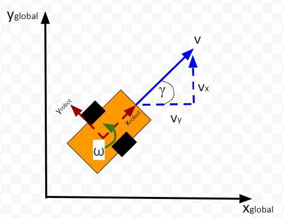
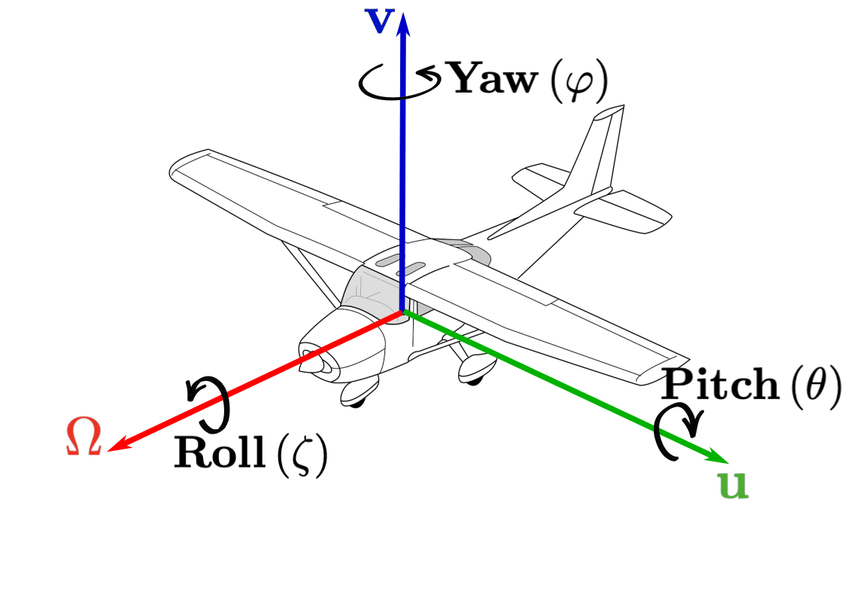

# Learning tf2

This package consists of my attempt learning `tf2` library in ROS.

## ROS Coordinate System

For `turtlesim`, it's only 2D.

## Transformation

Transformation describes the difference of coordinate **and** rotation between 2 frames.

### Roll-Pitch-Yaw

One aspect of Transformation is the roll-pitch-yaw. Since `turtlesim` is only 2D, we only use the `yaw` aspect.

## References

More about `tf2` [here](https://articulatedrobotics.xyz/tutorials/ready-for-ros/tf/).
