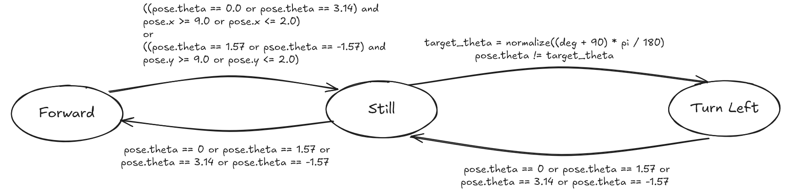

# My Robot Controller

This package contains the code from [Robotics Back-end's ROS Noetic for Beginners course](https://www.youtube.com/playlist?list=PLLSegLrePWgIbIrA4iehUQ-impvIXdd9Q), along with a custom node [draw_square.py](./scripts/draw_square.py) for me to practice ROS programming.

This package specifically focuses on controlling the Turtlebot from turtlesim package. Other aspects of ROS Noetic learning will be put in separate packages.

## `draw_square.py`

The goal is for the robot to go to the edge, then turn 90 degrees left, and then move forward, forming a circle.

### Goal

Draw a square when the turtle reaches the edge.

### State Transition

### Reference

If needed, I will look at [this code](https://docs.ros.org/en/noetic/api/turtlesim/html/draw__square_8cpp_source.html).
